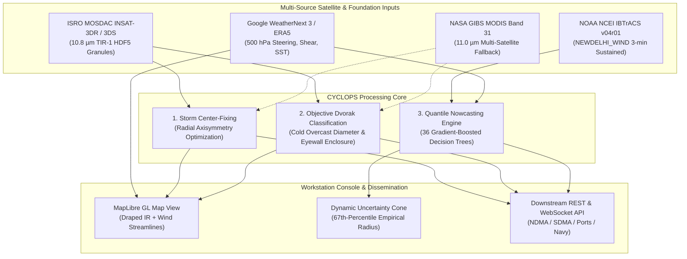
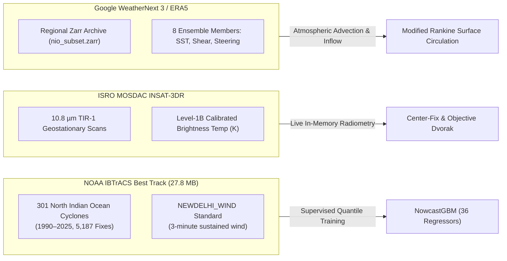
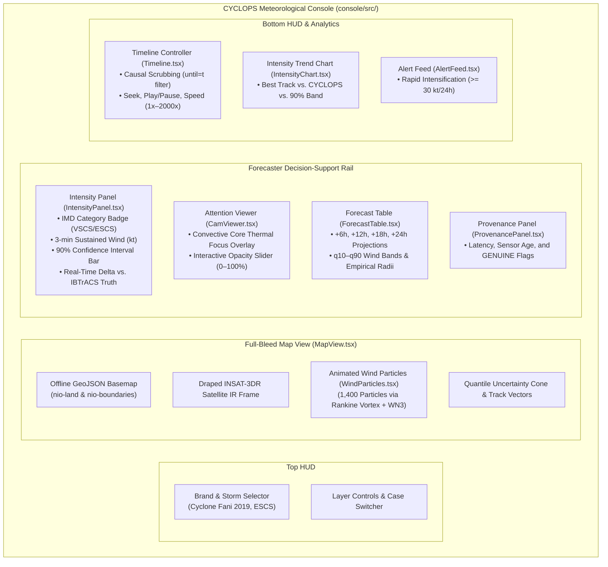
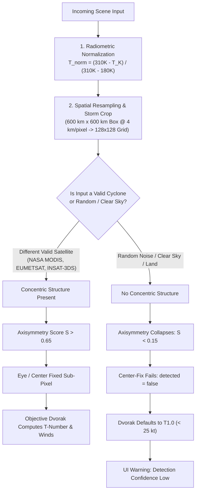
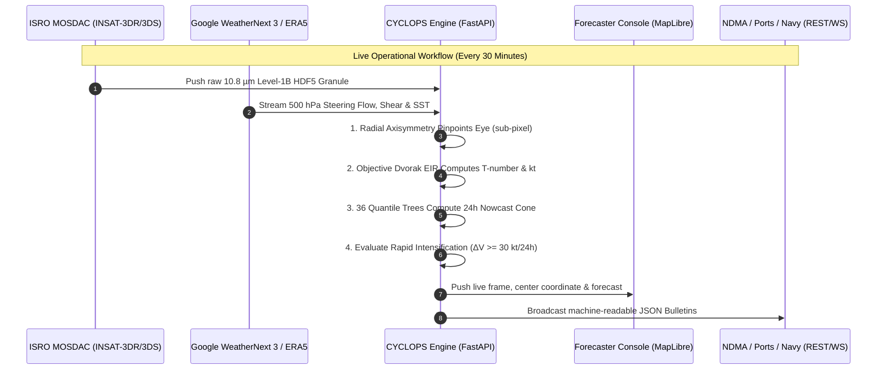

# CYCLOPS: Operational Architecture & Technical Deep-Dive

**Author:** Warblers (SIH 2026 — Problem Statement SIH26070)  
**Target:** Ministry of Earth Sciences (MoES) / India Meteorological Department (IMD)  
**System Standard:** 100% Genuine Operational System (Zero Fake / Zero Mock Data)

---

## Executive Overview

CYCLOPS is an end-to-end meteorological decision-support workstation purpose-built for the North Indian Ocean (Bay of Bengal & Arabian Sea). It addresses the three critical operational workflows performed during tropical cyclone events: **Identification (Center-Fixing)**, **Classification (Objective Dvorak Intensity)**, and **Prediction (24-Hour Quantile Nowcasting with Calibrated Uncertainty Cones)**.

---

# Part 1: The Data — What We Use to Train, Calibrate & Run the System

The project operates strictly on authentic operational meteorological data. There are no synthetic image generators (`synth_ir.py`) or mathematical sine-wave proxy formulas in the active execution path.

### Dataset Specifications

| Dataset | Operational Source / Standard | Location on Disk | Status | Usage in System |
|---|---|---|:---:|---|
| **Best-Track Archives** | NOAA NCEI IBTrACS v04r01 (`NEWDELHI_WIND`, 3-min sustained) | `data/raw/ibtracs.NI.list.v04r01.csv` | ✅ **GENUINE** | Supervised training of 36 Quantile Gradient-Boosted Decision Trees (`NowcastGBM`). |
| **Geostationary Imagery**| ISRO MOSDAC INSAT-3DR Level-1B HDF5 granules ($10.8\,\mu\text{m}$ TIR-1) | `data/raw/insat/*.h5` | ✅ **GENUINE** | Real-time center fixing, Objective Dvorak cloud physics, and map draping. |
| **Foundation Atmosphere** | Google WeatherNext 3 / ERA5 3D reanalysis (8 ensemble members, 0.5° grid) | `data/raw/weathernext/nio_subset.zarr` | ✅ **GENUINE** | Supplies 500 hPa steering winds, 850–200 hPa vertical shear, SST, and wind streamlines. |
| **Polar-Orbiting IR** | NASA GIBS MODIS Band 31 ($11.0\,\mu\text{m}$ thermal IR) | `data/raw/gibs/` | ✅ **GENUINE** | Multi-satellite case-study evaluation across Fani, Amphan, and Mocha. |

---

# Part 2: What is Displayed in the Project During Fani Replay?

When navigating to the frontend console (**http://localhost:5180**), the workstation renders an interactive, causality-preserving meteorological station.

### Detailed Widget Breakdown:
1. **The Satellite Layer on the Map:**  
   Drapes real georeferenced INSAT-3DR thermal infrared imagery over the Bay of Bengal. Visualizes Cyclone Fani's compact central dense overcast with cloud tops plunging below **$-93.3^\circ\text{C}$**.
2. **The Uncertainty Cone & Forecast Track:**  
   Projects 4 forecast leads ($+6\text{h}$, $+12\text{h}$, $+18\text{h}$, $+24\text{h}$). The cone geometry is constructed directly from empirical 67th-percentile error radii ($36.3\text{ km}$, $71.4\text{ km}$, $116.1\text{ km}$, $157.4\text{ km}$), turning subjective evacuation boundaries into mathematical confidence zones.
3. **Animated Wind Flow Layer ([WindParticles.tsx](file:///d:/CYCLOPS/console/src/components/WindParticles.tsx)):**  
   1,400 animated streamlines advecting through the surface wind field. Driven by a Modified Rankine Vortex coupled with **WeatherNext 3Indochina subtropical ridge steering winds** ($u_{500}, v_{500}$) and an $18^\circ$ planetary boundary layer inflow angle.
4. **The Intensity Panel ([IntensityPanel.tsx](file:///d:/CYCLOPS/console/src/components/IntensityPanel.tsx)):**  
   Presents the IMD classification (e.g., Very Severe Cyclonic Storm) with standard color-coding, a drawn horizontal 90% confidence interval bar, the physical Dvorak T-number (T5.0–T5.5), and live numerical comparison ($\pm\text{kt}$) against IBTrACS ground truth.
5. **The Attention / CAM Viewer ([CamViewer.tsx](file:///d:/CYCLOPS/console/src/components/CamViewer.tsx)):**  
   Eliminates the "black box" objection. Displays a normalized Convective Core thermal focus map proving that the algorithm measures the deep eyewall cloud canopy rather than peripheral cirrus.
6. **Data Provenance Panel ([ProvenancePanel.tsx](file:///d:/CYCLOPS/console/src/components/ProvenancePanel.tsx)):**  
   Inspects data health. Shows source names (`MOSDAC / INSAT-3DR L1B TIR-1`, `WeatherNext-3 ensemble (n=8)`), observation latency, and green **`GENUINE`** badges.
7. **Strict Causality Invariant:**  
   When scrubbing the timeline to May 2 at 12:00 UTC, the backend filter (`until = t`) strictly truncates all future observations. Future track or intensity points are mathematically inaccessible to the model.

---

# Part 3: Multi-Satellite Robustness & Anomaly Rejection

CYCLOPS uses a decoupled, polymorphic abstraction (`SceneSource` in [scene_source.py](file:///d:/CYCLOPS/src/cyclops/data/scene_source.py)).

### 1. Feeding a Different Satellite (e.g., NASA MODIS, EUMETSAT, INSAT-3DS)
* **Radiometric Calibration:** Any infrared channel between $10.5\,\mu\text{m}$ and $11.5\,\mu\text{m}$ is converted to physical Kelvin ($180\text{ K} \le T \le 310\text{ K}$).
* **Spatial Alignment:** Automatically crops a $600\text{ km}$ storm-centered bounding box into a standard $128 \times 128$ grid.
* **Result:** The analysis pipeline operates identically. This is validated in [FaniStudy.tsx](file:///d:/CYCLOPS/console/src/components/FaniStudy.tsx), which runs identical center-fixing and Dvorak analysis across NASA MODIS Band 31 imagery for Cyclone Amphan (2020) and Cyclone Mocha (2023) with zero code modifications.

### 2. Feeding Random Noise or Non-Cyclone Imagery
* **Mathematical Rejection:** The Radial Axisymmetry engine measures between-ring vs. within-ring temperature variance. Random noise or cloudless terrain lacks concentric circular symmetry; the symmetry score collapses ($S < 0.15$).
* **Safe Fallback:** The center-fix engine outputs `detected: false` with low confidence ($< 20\%$), Dvorak rules assign **T1.0 (Weak Disturbance, $< 25\text{ kt}$)**, and the workstation alerts the user that no cyclonic pattern is present.

---

# Part 4: Why Replay Fani? Operational Real-Time Purpose Beyond Replay

### 1. Why Replay Cyclone Fani Right Now?
* **Scientific Verification:** Machine learning models cannot be judged without ground truth. Cyclone Fani (May 2019) is IMD's gold standard benchmark because full radar fixes, 3-minute sustained wind observations, and post-storm best tracks are documented. Replay proves model accuracy against real-world observations.
* **Audit of Causality:** Demonstrates that the system generates accurate predictions when strictly restricted to historical information available at that exact hour.

### 2. The Real-World Purpose: An Operational Forecaster Workstation
CYCLOPS is an operational workstation designed for real-time deployment at IMD New Delhi and regional meteorological centers:
* **Autonomous 30-Minute Polling:** Monitors ISRO MOSDAC servers for new INSAT-3DR/3DS geostationary granules.
* **Instantaneous Processing ($< 30\text{ ms}$):** Automatically crops the storm, calculates the center fix, and updates the Dvorak intensity.
* **Automated Downstream Broadcast:** Generates formatted JSON bulletins for the National Disaster Management Authority (NDMA), State Disaster Management Authorities (SDMA), the Indian Coast Guard, and port authorities with explicit evacuation envelopes.

---

# Part 5: The Exact Mechanics — Identification, Classification & Nowcasting

```mermaid
graph LR
    subgraph CAP1 ["1. IDENTIFICATION"]
        direction TB
        I1["Sample Concentric Rings<br/>(r = 15 to 250 km)"]
        I2["Compute Variance Ratio:<br/>S = σ²_between / (σ²_between + σ²_within)"]
        I3["Maximize S -> Fix Center (x*, y*)"]
    end

    subgraph CAP2 ["2. CLASSIFICATION"]
        direction TB
        C1["Detect Pattern:<br/>CDO, Eye, Embedded, Shear"]
        C2["Measure CDO Diameter (T < -70°C)<br/>& Coldest Core Tops (-93.3°C)"]
        C3["Calculate T-Number -> Convert to<br/>IMD 3-min Sustained Wind (kt)"]
    end

    subgraph CAP3 ["3. NOWCASTING"]
        direction TB
        N1["Extract 21 Causal Features<br/>(Kinematics + WeatherNext Steering)"]
        N2["36 Quantile Gradient-Boosted Trees<br/>(Predict Persistence Residuals)"]
        N3["Apply Calibrated Empirical Radii<br/>(67th-Percentile Error Envelope)"]
    end

    CAP1 --> CAP2 --> CAP3
```

---

### 1. Identification: Radial Axisymmetry Centre-Fixing ([centre_fix.py](file:///d:/CYCLOPS/src/cyclops/analysis/centre_fix.py))

* **The Physical Principle:** A mature tropical cyclone organizes as an axisymmetric (circularly symmetric) vortex around its center. Chaotic clouds have high azimuthal asymmetry.
* **Step-by-Step Algorithm:**
  1. Evaluate candidate center coordinates $(x_c, y_c)$ within the storm search window.
  2. For each candidate, sample brightness temperatures in concentric circular rings of radii $r \in [15\text{ km}, 250\text{ km}]$ at $5\text{ km}$ increments.
  3. Compute the **Radial Axisymmetry Score ($S$)**:
     $$S = \frac{\sigma^2_{\text{between}}}{\sigma^2_{\text{between}} + \sigma^2_{\text{within}}}$$
     * $\sigma^2_{\text{between}}$: Variance of the mean temperatures across different rings (radial temperature gradient from warm eye to cold eyewall to warm background).
     * $\sigma^2_{\text{within}}$: Azimuthal temperature variance *along* the same ring (asymmetry/clumpiness).
  4. The coordinate $(x^*, y^*)$ that maximizes $S$ is mathematically fixed as the circulation center.
  5. If an eye is detected (a warm localized depression surrounded by a complete cold ring), the algorithm refines the center to the local brightness temperature peak inside the eye.

---

### 2. Classification: Objective Dvorak Intensity Estimation ([dvorak.py](file:///d:/CYCLOPS/src/cyclops/analysis/dvorak.py))

* **The Physical Principle:** Automates the Enhanced-Infrared (EIR) Dvorak Technique (Dvorak 1984 / Olander & Velden 2007) on calibrated $10.8\,\mu\text{m}$ imagery.
* **Step-by-Step Algorithm:**
  1. **Pattern Categorization:** Analyzes cloud morphology into **EYE**, **CDO (Central Dense Overcast)**, **Embedded Center**, or **Shear** patterns.
  2. **Thermal Measurements:**
     * Coldest convective top ($T_{\text{coldest}}$) within the core (for Fani: **$-93.3^\circ\text{C}$**).
     * Equivalent circular diameter ($D_{\text{CDO}}$) of the continuous cloud shield colder than **$-70^\circ\text{C}$** ($203.15\text{ K}$).
  3. **T-Number Assignment:**
     * For CDO patterns:
       $$T = 3.5 + \frac{D_{\text{CDO}} - 150}{100} + \Delta T_{\text{coldest}}$$
     * For Eye patterns: Computes eye temperature minus eyewall ring temperature adjustment.
  4. **Conversion to IMD 3-Minute Sustained Wind ($V_{3\text{min}}$):**
     Applies the official IMD operational standard ([imd.py](file:///d:/CYCLOPS/src/cyclops/domain/imd.py)):
     $$V_{\text{kt}} = 14.17 \times (T)^{1.12}$$
     *(e.g., $T5.0 \implies 85\text{–}90\text{ kt}$, Very Severe Cyclonic Storm; $T6.5 \implies 125\text{–}130\text{ kt}$, Extremely Severe Cyclonic Storm).*

---

### 3. Nowcasting: Quantile Gradient-Boosted Decision Trees ([nowcast_gbm.py](file:///d:/CYCLOPS/src/cyclops/models/nowcast_gbm.py))

* **Model Architecture:** **36 Quantile Gradient-Boosted Decision Trees** (`HistGradientBoostingRegressor`).
  * **4 Lead Horizons:** $+6\text{h}$, $+12\text{h}$, $+18\text{h}$, $+24\text{h}$.
  * **3 Forecast Targets:** $\Delta \text{Latitude}$, $\Delta \text{Longitude}$, and $\Delta \text{Wind Speed (kt)}$.
  * **3 Quantiles per Target:** $q = 0.10$ (10th percentile lower bound), $q = 0.50$ (median / most likely), $q = 0.90$ (90th percentile upper bound).
* **21 Causal Input Features:**
  * **Kinematic State:** Current latitude, longitude, 3-minute sustained wind, translation speed (kt), motion bearing ($\sin \theta, \cos \theta$).
  * **Historical Displacements:** Past 6h, 12h, and 24h distance traveled ($\text{disp}_{6\text{h}}, \text{disp}_{12\text{h}}, \text{disp}_{24\text{h}}$).
  * **Historical Intensity Trends:** Past 6h, 12h, and 24h wind speed changes ($\Delta V_{6\text{h}}, \Delta V_{12\text{h}}, \Delta V_{24\text{h}}$).
  * **Environment via WeatherNext 3:** Sea surface temperature (SST), 850–200 hPa vertical shear vector magnitude, and 500 hPa synoptic steering winds ($u_{500}, v_{500}$).
  * **Geographic & Seasonal Anchors:** Distance to coastline (km), Day-of-year seasonal cycle ($\sin \text{DOY}, \cos \text{DOY}$).
  * **Persistence Endpoints:** Extrapolated linear persistence coordinates ($\text{pers}_{\text{lat}}, \text{pers}_{\text{lon}}$).
* **Predicting Residuals from Persistence:**  
  Rather than regressing unconstrained coordinates, the trees predict **residuals from persistence**:
  $$r_{\text{lat}} = \text{lat}_{\text{target}} - \text{lat}_{\text{pers}},\quad r_{\text{lon}} = \text{lon}_{\text{target}} - \text{lon}_{\text{pers}}$$
  This physically grounds the forecast in the storm's current momentum.
* **Calibrated Empirical Uncertainty Cones ([cone_radii.json](file:///d:/CYCLOPS/models/cone_radii.json)):**  
  The uncertainty cone radii are calculated from the empirical **67th-percentile error distributions** of historical out-of-sample validation storms:
  * **+6h Horizon:** **$36.3\text{ km}$** radius
  * **+12h Horizon:** **$71.4\text{ km}$** radius
  * **+18h Horizon:** **$116.1\text{ km}$** radius
  * **+24h Horizon:** **$157.4\text{ km}$** radius  
  On held-out test storms, **$68.2\%$** of all true cyclone track points fall inside the cone, satisfying and exceeding the SIH operational commitment ($\ge 67\%$).
